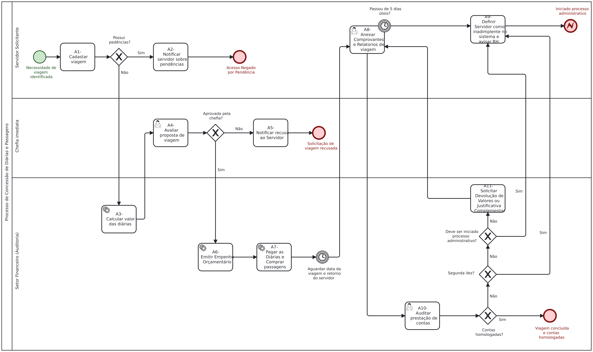

# ✈️ Sistema de Concessão de Diárias e Prestação de Contas

Este repositório apresenta a arquitetura de processos, modelagem analítica em notação BPMN e a especificação técnica de requisitos para um sistema de gestão de viagens corporativas e governamentais.

---

## 💾 Downloads e Acesso Rápido

Acesse e baixe os artefatos do projeto diretamente nos botões ou na tabela abaixo:

[-2ea44f?style=for-the-badge&logo=adobeacrobatreader&logoColor=white)](./especificacao-tecnica-scadp.pdf)

 

| Recurso / Artefato | Descrição | Link de Download / Visualização |
| :--- | :--- | :---: |
| 📄 **Documentação do Projeto** | Especificação completa em PDF (18 RFs, RNFs, LGPD, Histórias de Usuário e Gherkin) | [⬇️ Baixar PDF](./especificacao-tecnica-scadp.pdf) |
| ⚙️ **Modelagem Original (.bpmn)** | Arquivo XML nativo para importação no Camunda / BPMN.io | [⬇️ Baixar .BPMN](./bpmn-scadp-v1.0.bpmn) |
| 🖼️ **Diagrama do Processo (PNG)** | Imagem em alta resolução da modelagem de processos | [🖼️ Baixar PNG](./diagrama-scadp-v1.0.png) |

---

## 🎯 O Problema Resolvido

O fluxo foi projetado com foco em governança e integridade de dados, eliminando o problema clássico de "loops infinitos" em prestações de contas rejeitadas. Foram implementadas regras de negócio automatizadas para controle estrito de reincidências e desvios automáticos para tratamento de irregularidades pela área de Recursos Humanos.

---

## 🗺️ Modelagem do Processo (BPMN)

Abaixo está a representação visual do ecossistema de validação sequencial após a auditoria do processo:

  
   
  <small><i>Clique na imagem para abrir em alta resolução ou <a href="./diagrama-scadp-v1.0.png" download>faça o download aqui</a>.</i></small>

---

## 📑 Documentação Técnica Completa (PDFs)

Devido à alta densidade e profundidade da especificação de Engenharia de Software, os artefatos foram organizados em documentos dedicados para leitura detalhada:

* 📄 **[Baixar Documentação Completa do Projeto (PDF)](./especificacao-tecnica-scadp.pdf)**  
  *Contém os 18 Requisitos Funcionais mapeados nas atividades, os Requisitos Não Funcionais correspondentes focados em LGPD, User Stories no padrão ágil, os critérios de aceite mapeados em formato Gherkin (Dado/Quando/Então) para validação dos cenários de teste, segurança de back-end e performance.*

* ⚙️ **[Baixar Arquivo de Modelagem Original (.bpmn)](./bpmn-scadp-v1.0.bpmn)**  
  *Arquivo XML nativo para importação direta na ferramenta BPMN.io ou Camunda.*

---

## 🛠️ Ferramentas e Metodologias

---

## 👨‍💻 Autor

**Álvaro Costa**  
*Analista de Sistemas | Analista de Negócios e Requisitos*

Especializado em:
- Engenharia de Requisitos
- BPMN
- Business Analysis
- Modelagem de Processos
- Levantamento e Especificação de Requisitos
